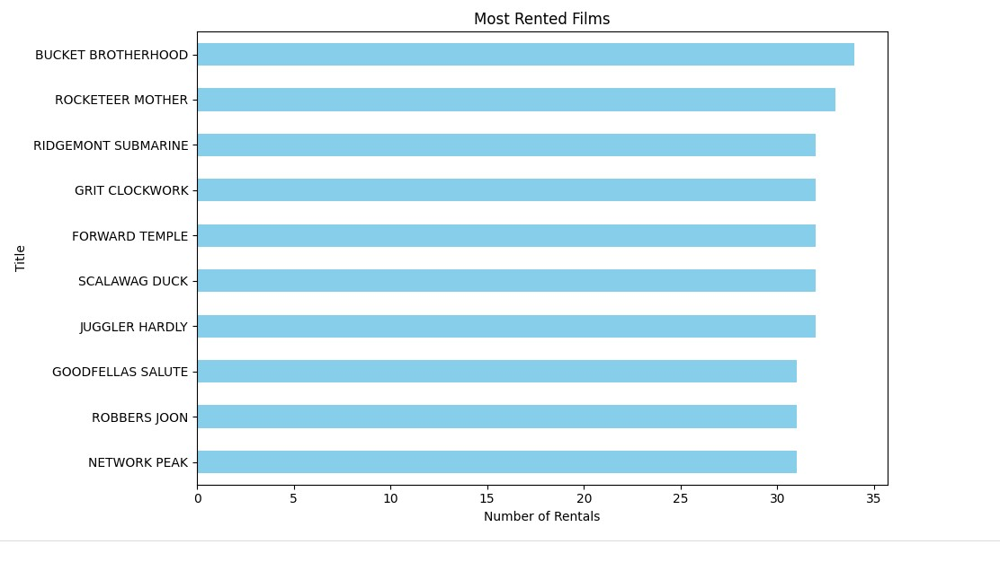
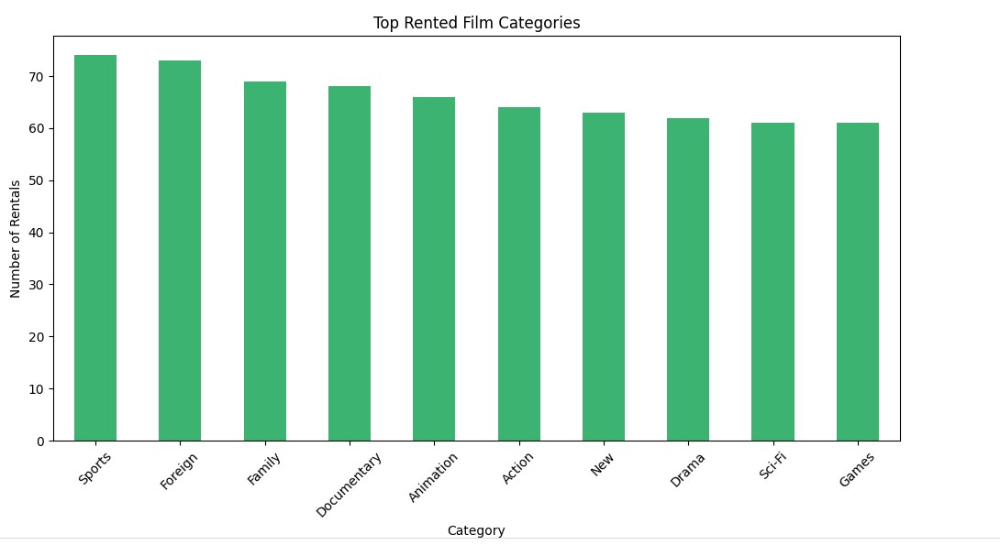
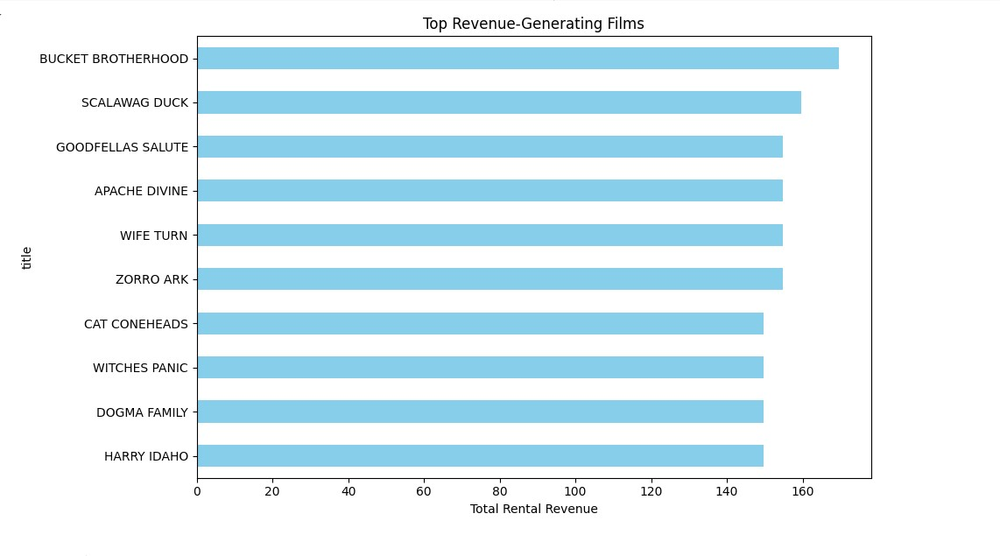

# Maven-Movies-Analytics
This project demonstrates end-to-end data analysis for a movie rental business, utilising SQL and Python.

## 📌 Project Summary
- Exported key tables (`film`, `category`, `film_category`, `rental`, `customer`, `inventory`) from the original SQL database
- Performed **data cleaning, joining, and merging** using Pandas
- Removed redundant or unused columns and handled null values
- Conducted **exploratory data analysis (EDA)** to uncover:
  - Most rented categories and films
  - Top revenue-generating films
  - Rental trends by customer
- Created insightful **visualisations** using `matplotlib` and `seaborn`

## 🛠️ Tools & Technologies
- Python (Pandas)
- Matplotlib & Seaborn
- Jupyter Notebook
- MySQL Workbench
  

## 📊 Key Insights
- "Sports", "Foreign", and "Family" were the most rented film categories
- Customers with the highest rental frequency were identified
- Top films by rental revenue were visualised
- Horizontal bar plots are used for better readability of long titles

## EDA Visualisation

Here’s a snapshot of the cleaned data and insights:

##Most Popular Film by Rental Count

##Top Rented Film Category

##Top Revenue Films

